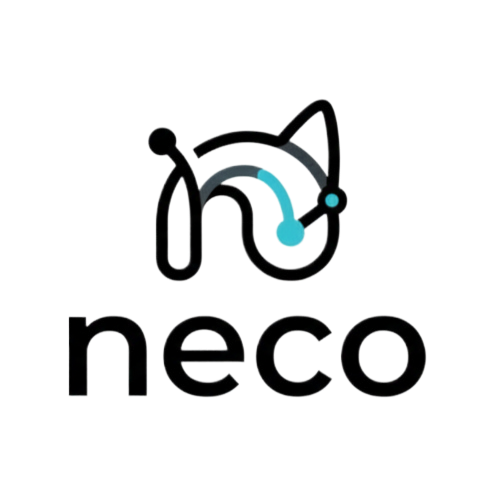
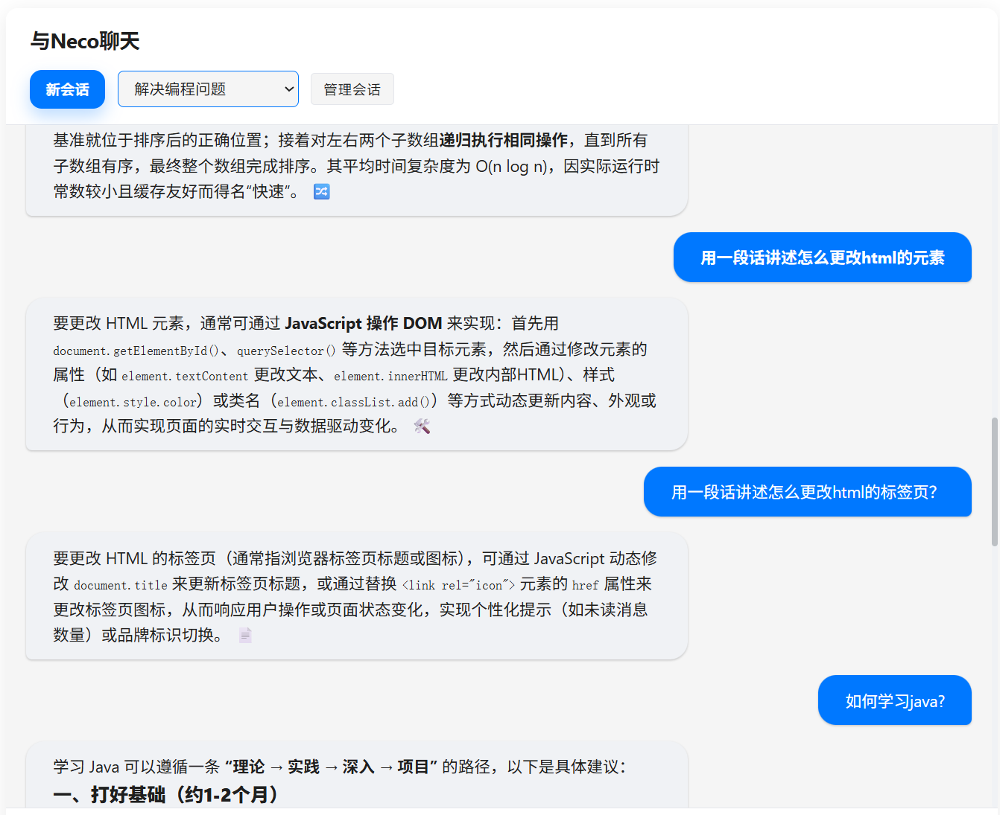
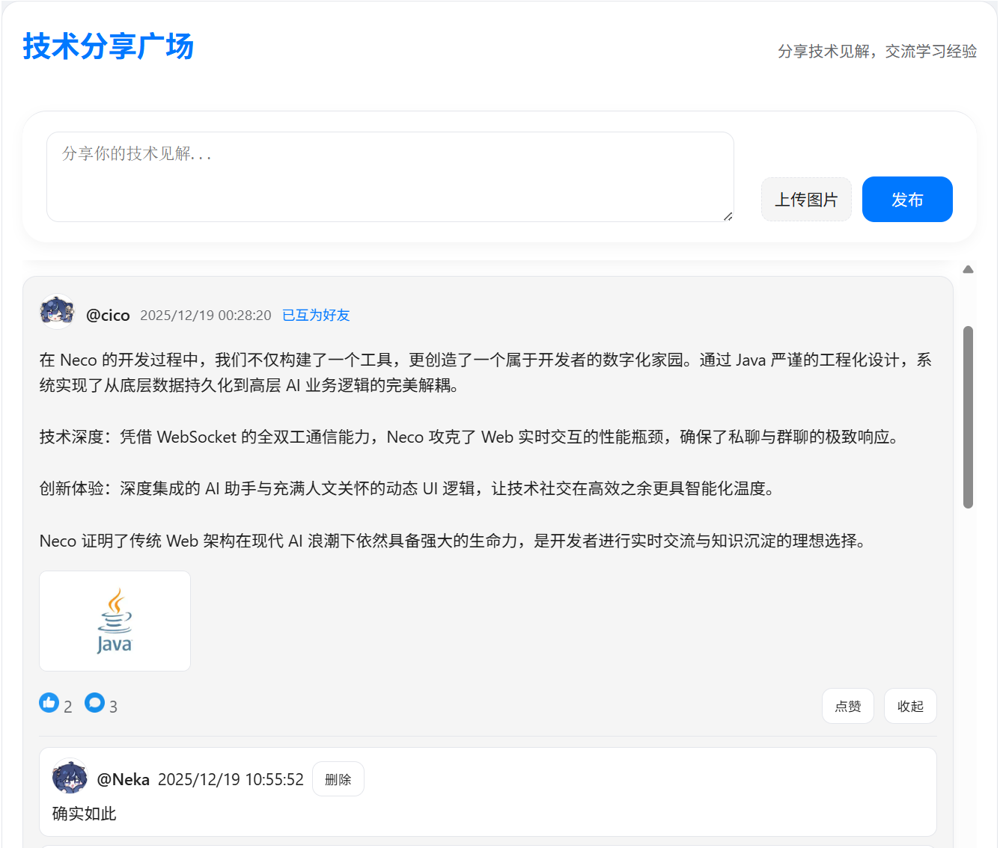
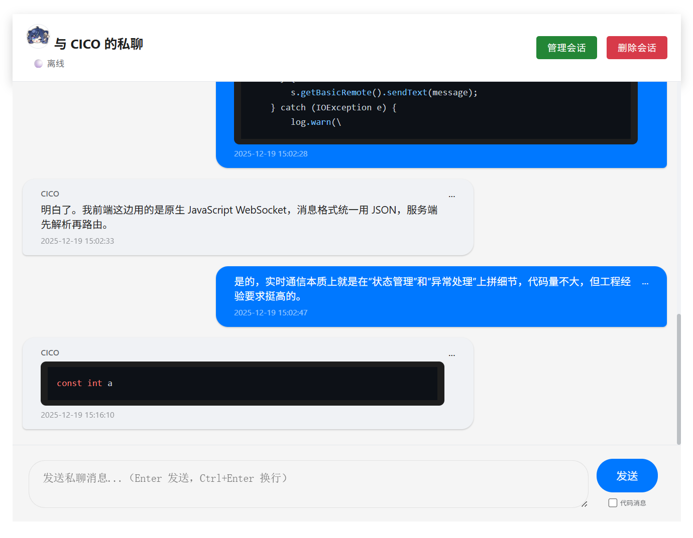
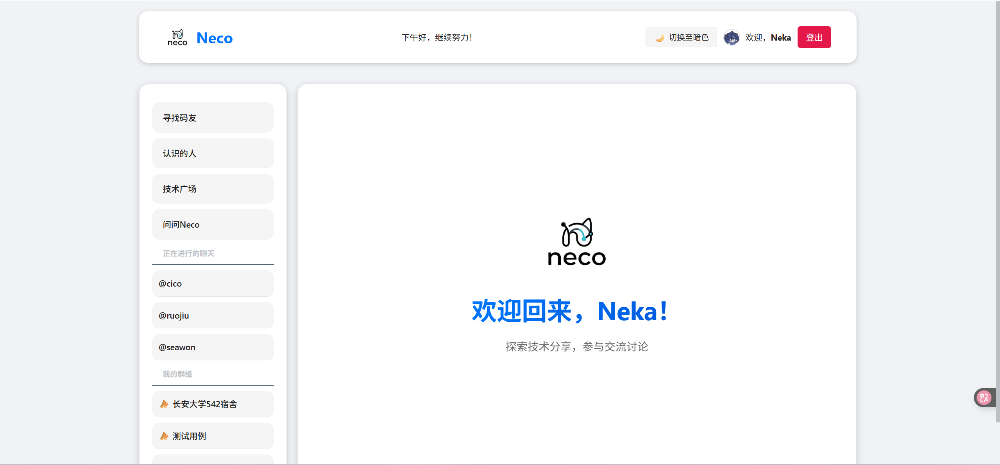
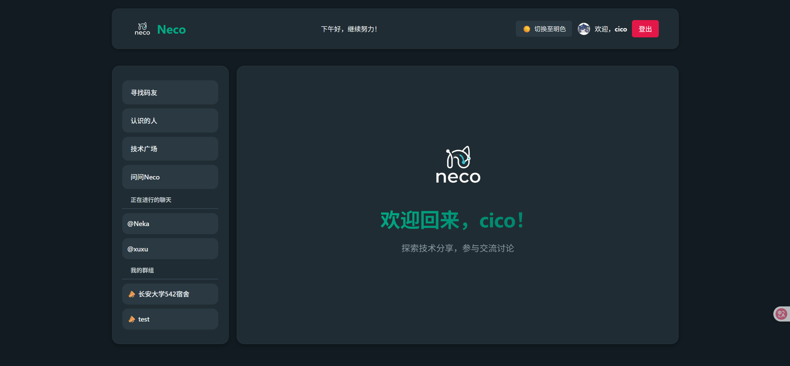

<div align="center">
    
</div>
<div align="center">
    # 技术信息流分享智能社交平台
</div>

**Neco** 是一款基于 ~~Java Web 经典技术栈~~开发的智能社交平台。它不仅实现了~~流畅的~~实时通讯、社交广场和个人空间，还集成了 **DeepSeek AI**，为你提供 24/7 的智能陪伴与知识问答服务

> **~~不仅仅是聊天，更是智能社交的新起点~~**

---
## 🛠️ 技术栈


### 后端 (Backend)

* **核心框架**: Java Servlet 4.0 + JSP
* **实时通信**: Java WebSocket API

* **数据库**: MySQL 8.0+
* **AI Chat**:DeepSeek API

### 前端 (Frontend)

* **脚本引擎**: jQuery 3.7.1
* **UI 组件**: 自定义 CSS
* **内容渲染**:
    * `markdown-it`: Markdown 格式化
    * `highlight.js`: 代码片段语法高亮
* **主题控制**: 基于 CSS Variables 的动态切换

### 工具部署 (Tools)
* **Web服务器**: Tomcat 8.0+
* **IDE**: IntelliJ IDEA 2025.2.1

---

## ✨ 核心特性

* **🤖 集成 DeepSeek AI**:
    * 支持上下文关联的连续对话
    * 采用 `markdown-it` 实现格式渲染，极佳的阅读体验
    * 会话持久化存储，历史记录随时查阅


* **💬 全方位通讯体验**:
    * **私聊系统**: 基于 WebSocket 的实时消息推送
    * **群组社交**: 轻松创建群聊，管理成员，分享趣闻


* **📝 动态广场**:
    * 发布图文动态，支持点赞与评论交互
    * 感受社区脉搏，与志同道合的小伙伴交流


* **🛡️ 安全与性能**:
    * 用户密码采用加盐哈希（PBKDF2/SHA-256）存储
    * 统一的 `AuthFilter` 权限控制，确保接口访问安全
    * 经典的 DAO 设计模式，数据库操作解耦且高效


* **🎨 现代 UI/UX**:
    * 响应式设计，适配不同屏幕尺寸
    * **深色/浅色模式**无缝切换

---


## 🚀 快速开始与部署

### 1. 环境准备

本地开发环境已安装：

* **JDK 1.8+**
* **Maven** (或手动导入 `web/WEB-INF/lib` 下的依赖)
* **MySQL 8.0+**
* **Apache Tomcat 8.0+**

### 2. 数据库配置

1. 执行 `db/neco_chat_db.sql` 脚本，创建数据库及表结构
2. 修改 `web/WEB-INF/classes/db.properties`：
```properties
db.url=jdbc:mysql://localhost:3306/neco_chat_db?useSSL=false&serverTimezone=UTC
db.user=your_username
db.password=your_password

```


### 3. AI 接口配置

申请 [DeepSeek API Key](https://platform.deepseek.com/)，并填写至 `web/WEB-INF/classes/ai.properties`：

```properties
ai.api.key=your_deepseek_api_key_here
ai.api.url=https://api.deepseek.com/chat/completions
ai.model=deepseek-chat

```

### 4. 运行

将项目打包为 `WAR` 包或直接在 IntelliJ IDEA/Eclipse 中配置 Tomcat 运行访问 `http://localhost:8080/NecoChat` 即可开启体验

---

## 📸 界面预览

- **核心功能**

| 智能 AI 对话 | 动态广场 | 私聊界面 |
| :--: | :--: | :--: |
| |  | |
| *支持MarkDown格式的 AI 交互* | *图文并茂的社区动态* | *毫秒级延迟消息响应*|

- **主题切换**

| 明色主题 | 暗色主题 |
| :--: | :--: |
|||
| *简约明亮* | *暗黑炫酷* |
---

## 📂 项目结构

```text
NecoChat/
├── db/                 # 数据库 SQL 脚本
├── src/                # Java 源代码
│   ├── dao/            # 数据访问层
│   ├── model/          # 实体类
│   ├── service/        # 业务逻辑 (包含 DeepSeek 客户端)
│   ├── servlet/        # 控制层
│   ├── util/           # 工具类 (Db, Json, Password)
│   └── websocket/      # WebSocket 端点
├── web/                # Web 资源
│   ├── assets/         # CSS, JS, Images
│   ├── WEB-INF/        # 配置文件与 Lib
│   └── *.jsp           # 页面文件
├── image_src/          # README 静态资源 
└── README.md

```

---

## 🤝 贡献

> **University**: [Chang'an University](https://chd.edu.cn)

> **Mail**: wenyi4546@gmail.com

> **Repository**: [Neco-App](https://github.com/neka-ev/neco-app)


---

*Powered by DeepSeek & Pure Java.*